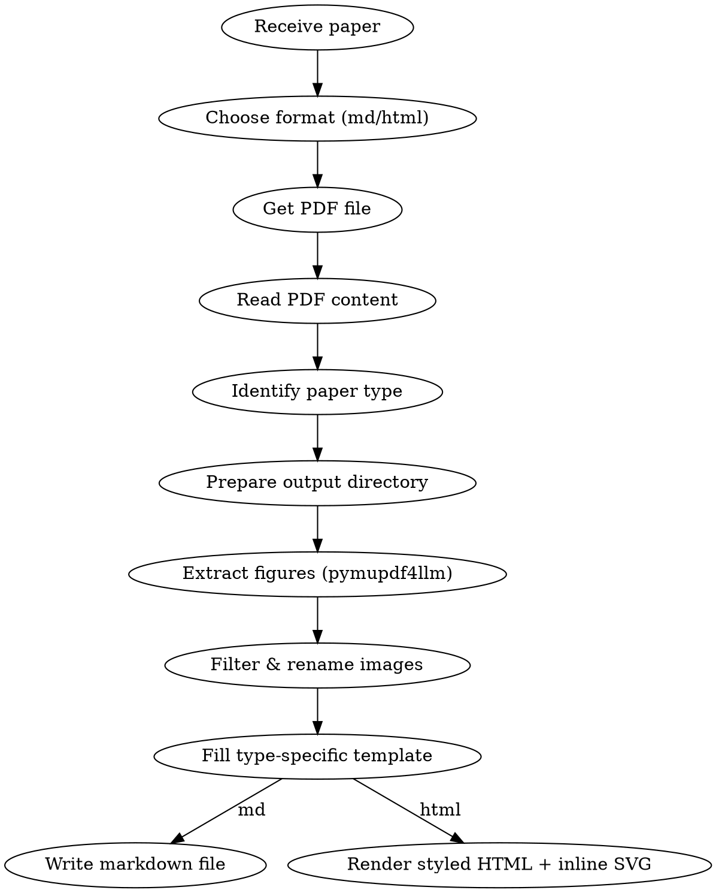

# Paper Reading - Research Paper Summarization

## Overview

A structured approach to reading and summarizing scientific research papers. **Automatically identifies paper type** (empirical/theoretical/survey/systems), selects the appropriate template, screenshots important figures, and embeds them in the summary document.

## When to Use

- User provides a paper (PDF path, URL, or pasted content) and asks for summary
- User asks to "read", "summarize", or "analyze" a research paper
- User wants to understand a paper's contribution quickly
- Literature review tasks

**Not for:** Tutorial papers, textbooks, or non-research documents

## Workflow



## Step 0: Choose Output Format (md vs html)

Settle the output format before doing the work — it shapes how you present everything downstream, and the token cost difference is real, so the user deserves the choice.

- **User already named a format** → honor it, don't ask. Treat a request for a web page, a "nice-looking"/visual summary, or an explicit "html" as HTML; treat "md"/"markdown"/plain-text requests as Markdown. The user may phrase this in any language — match on intent, not on literal English keywords.
- **User didn't say** → ask one short question **in the user's language** and wait for the answer. Name the trade-off honestly rather than guessing: Markdown is lightweight and token-cheap (good for archiving and re-editing), while HTML looks better and adds hand-drawn SVG flowcharts/diagrams at the key points to aid understanding, but costs more tokens.

Both formats share the **same content backbone**: the type-specific template, the same extracted figures, the same depth-first writing. HTML is not a different or thinner summary — it's the same analysis, presented so a reader grasps it faster. So always do the full analysis (Steps 1–4), then either write Markdown or render it as HTML (see **HTML Output Mode** near the end).

## Step 1: PDF Acquisition

All papers are processed as PDF. No HTML/ar5iv path.

| Source | Detection | Action |
|--------|-----------|--------|
| Local PDF | File path ends with `.pdf` | Use directly |
| arXiv URL | Contains `arxiv.org` | Extract paper ID → download `https://arxiv.org/pdf/XXXX.XXXXX` |
| Other URL | Default | Try downloading as PDF; if not a PDF, use WebFetch for text |

### Download Flow

```bash
# For arXiv: extract ID and download PDF
curl -L -o <output_dir>/paper.pdf "https://arxiv.org/pdf/XXXX.XXXXX"

# For other URLs: try direct download
curl -L -o <output_dir>/paper.pdf "<url>"
# Verify it's a valid PDF: file <output_dir>/paper.pdf should show "PDF document"
```

### Read Content

Use the **Read tool** to read the PDF file. Claude natively supports reading PDF files and extracting text content. For large PDFs (>10 pages), read in page ranges (e.g., `pages: "1-10"`, then `pages: "11-20"`).

## Step 2: Paper Type Identification

After reading the title, abstract, and introduction, determine paper type:

| Type | Identification Signals |
|------|----------------------|
| **Empirical** | Proposes new method/model, has experimental comparisons, includes baselines |
| **Theoretical** | Theorem/proof-driven, math-heavy derivations, few or no experiments |
| **Survey** | Many citations (>100), taxonomy/classification, "survey"/"review" keywords |
| **Systems** | System design, engineering implementation, benchmarks, deployment experience |

**When uncertain, default to the Empirical template.**

## Step 3: Figure & Table Extraction (pymupdf4llm)

### 1. Prepare Output Directory

```bash
mkdir -p <output_dir>/images
```

### 2. Screenshot Priority Guide

| Priority | Figure Type | When to Capture |
|----------|-------------|-----------------|
| Must | System architecture / overall framework | If available |
| Must | Main experiment results table/chart | If available |
| Recommended | Core algorithm flowchart | If available |
| Recommended | Ablation study charts | If available |
| Optional | Visualization / qualitative results | If space allows |
| Optional | Auxiliary illustrations | As needed |

Capture **3-8** key figures per paper. If the paper has few or no meaningful figures (e.g., theoretical papers, short workshop papers), skip figure extraction and produce a text-only summary.

### 3. Automated Extraction with pymupdf4llm

Use pymupdf4llm to extract all images and vector graphics in one call. This handles raster images (photos, embedded figures) AND vector graphics (plots, diagrams, flowcharts) automatically.

**Prerequisites:** `pymupdf` and `pymupdf4llm` must be installed in the conda base environment.

```bash
# Install if needed (one-time)
source $HOME/anaconda3/etc/profile.d/conda.sh && conda activate base
pip install pymupdf4llm
```

**Run extraction:**

```bash
source $HOME/anaconda3/etc/profile.d/conda.sh && conda activate base && python3 << 'PYEOF'
import pymupdf4llm
import os

pdf_path = "<pdf_path>"
image_dir = "<output_dir>/images"
os.makedirs(image_dir, exist_ok=True)

# Extract all figures, tables, and vector graphics as images
md_result = pymupdf4llm.to_markdown(
    pdf_path,
    write_images=True,
    image_path=image_dir,
    image_format="png",
    dpi=200,
    use_ocr=False,        # Disable OCR (avoids tesseract dependency)
)

# List extracted images
for f in sorted(os.listdir(image_dir)):
    if f.endswith(('.png', '.jpg', '.jpeg')):
        from PIL import Image
        try:
            img = Image.open(os.path.join(image_dir, f))
            print(f"{f}: {img.size[0]}x{img.size[1]}")
        except:
            print(f"{f}: (size unknown)")
PYEOF
```

### 4. Filter & Rename Extracted Images

pymupdf4llm extracts ALL graphical regions, including logos, watermarks, and decorative elements. Filter and rename:

**Step 4a: Filter out noise** — Remove images that are:
- Too small (< 100x100 px) — likely icons or logos
- Too narrow (aspect ratio > 10:1 or < 1:10) — likely decorative lines or borders

```bash
source $HOME/anaconda3/etc/profile.d/conda.sh && conda activate base && python3 << 'PYEOF'
import os
from PIL import Image

image_dir = "<output_dir>/images"
removed = []
for f in os.listdir(image_dir):
    path = os.path.join(image_dir, f)
    try:
        img = Image.open(path)
        w, h = img.size
        ratio = max(w, h) / max(min(w, h), 1)
        if w < 100 and h < 100:
            os.remove(path)
            removed.append(f"{f} (too small: {w}x{h})")
        elif ratio > 10:
            os.remove(path)
            removed.append(f"{f} (too narrow: {w}x{h})")
    except:
        pass

print(f"Removed {len(removed)} noise images:")
for r in removed:
    print(f"  - {r}")

kept = [f for f in sorted(os.listdir(image_dir)) if f.endswith(('.png', '.jpg'))]
print(f"\nKept {len(kept)} images:")
for f in kept:
    img = Image.open(os.path.join(image_dir, f))
    print(f"  {f}: {img.size[0]}x{img.size[1]}")
PYEOF
```

**Step 4b: Visual review & rename** — Use the Read tool to view each remaining image. Based on content:
- Rename to descriptive names: `figure_1_overview.png`, `table_2_main_results.png`, etc.
- Delete any remaining non-figure images (headers, footers, etc.)
- Select 3-8 key figures for the summary based on the priority guide above

### 5. Fallback: Manual pymupdf clip extraction

If pymupdf4llm misses a specific figure or table (rare), use direct pymupdf clip rendering:

```bash
source $HOME/anaconda3/etc/profile.d/conda.sh && conda activate base && python3 << 'PYEOF'
import fitz

doc = fitz.open("<pdf_path>")
page = doc[PAGE_NUM]  # 0-indexed

# Render a specific region at high resolution
clip = fitz.Rect(x0, y0, x1, y1)  # coordinates from page layout
mat = fitz.Matrix(3, 3)  # 3x zoom
pix = page.get_pixmap(matrix=mat, clip=clip)
pix.save("<output_dir>/images/figure_N_desc.png")
doc.close()
PYEOF
```

To find coordinates: use `page.get_text("dict")` to find text blocks containing "Figure N" or "Table N", then estimate the figure region nearby.

### File Naming

Format: `figure_N_<brief_desc>.png` / `table_N_<brief_desc>.png`

Examples:
- `figure_1_overview.png` — system overview
- `figure_2_architecture.png` — model architecture
- `table_3_comparison.png` — main results table
- `figure_4_ablation.png` — ablation study

## Step 4: Fill Template

### After identifying paper type, select the corresponding template

### Writing Principles (Critical)

**Depth-first**: For every section, ask "why" and "how", not just "what".

| Shallow writing (prohibited) | Deep writing (required) |
|------------------------------|------------------------|
| "Proposes a new method" | "Addresses bottleneck Y in problem X via mechanism Z" |
| "Achieves SOTA results" | "Improves X% over method B on dataset A, primarily because of Y" |
| "Uses a Transformer" | "Uses L-layer Transformer with input dim D, H attention heads, key modification is Z" |
| "Has some limitations" | "Only validated in scenario X, does not account for distribution shift Y, assumption Z may not hold in practice" |

### After identifying paper type, select the corresponding template

All types share these sections:

```markdown
## Basic Information
- **Title:**
- **Authors:**
- **Affiliation:** (optional)
- **Published:**
- **Link:**
- **Paper Type:** [Empirical / Theoretical / Survey / Systems]
- **One-line summary:** What was done + how + what was the result

## Research Problem
- **What problem does it solve?** Identify the specific gap in existing methods
- **Key assumptions:** What constraints/limitations frame the research
- **Why is it important?** The practical impact on the field
- **Positioning among related work:** What are the 2-3 closest prior works? What is the key difference?
```

---

### Template A: Empirical Paper

```markdown
## Basic Information
[shared section]

## Research Problem
[shared section]
- **Mathematical formulation:** (optional)

<!-- Insert problem definition/motivation figure here if available -->

## Key Insight
> Distill the paper's core new idea in 2-3 sentences. Not "what was done", but "what insight makes this method work".
> Example: Rather than predicting frame-by-frame, first establish long-term 3D point tracking, then leverage temporal consistency for joint optimization.

## Technical Method
### Overall Framework and Principles
<!-- Insert architecture diagram -->
<!-- Insert figure here:  -->

- Overall system architecture description
- Modules/components and their responsibilities
- Signal/data flow direction
- **Why this design?** Advantages over the intuitive/naive approach

### Core Component Details
<!-- Insert algorithm flowchart here if available -->

- Model/algorithm architecture details (layers, dimensions, input/output)
- Training objective and loss function (write key equations)
- Training data source (synthetic/real/mixed, dataset names and scale)
- Key tricks and design decisions
- **Motivation for each design choice:** Why use A instead of B? Does the paper provide justification?

## Experimental Results
<!-- Insert experiment result figures/tables -->
<!-- Insert figure here:  -->

### Results (Facts)
- **Experimental setup:** Environment, hardware, hyperparameters
- **Baselines compared:** List specific method names and sources
- **Key results:** Quantitative improvement margins (specific numbers + percentages)
- **Ablation study:** Component contributions (removing X decreases performance by Y%)
- **Surprising findings:** Any counterintuitive results

### Analysis (Interpretation)
- Authors' explanation and attribution of results
- Which scenarios/datasets show best performance? Worst?
- Root cause of performance gains (authors' claims vs actual evidence)

<!-- Insert ablation or visualization result figures here if available -->

## Critical Analysis
### Strengths
- Specific improvements over prior work (not just "good results")

### Limitations
- **Acknowledged by authors:**
- **My observations:** Issues not mentioned in the paper
  - Do assumptions hold in practice?
  - Are compute/data requirements reasonable?
  - Are evaluation metrics comprehensive?

### Reproducibility Assessment
- Is code open-sourced? Is data available?
- Are key implementation details sufficiently described?

## Summary
[shared section]
```

---

### Template B: Theoretical Paper

```markdown
## Basic Information
[shared section]

## Research Problem
[shared section]
- **Mathematical formulation:** Formal problem definition

## Key Insight
> Distill the paper's core theoretical contribution in 2-3 sentences. What new mathematical tool/perspective makes this result possible?

## Theoretical Framework
### Problem Formalization
- Symbol definitions and notation conventions
- Core mathematical definitions

### Main Theorems and Proof Sketches
- **Theorem 1:** Statement + key proof idea (not full proof, but key steps and key lemmas)
- **Theorem 2:** ...
- Key techniques used in proofs: Why does this technique work? Is there a more intuitive explanation?

### Theoretical Analysis
- Implications and intuitive interpretation of results (restate in non-mathematical language)
- Tightness of upper/lower bounds
- Relationship to and comparison with known results: Which bound was improved? Which assumption was relaxed?

## Validation (if experiments exist)
- Experimental setup
- Comparison of theoretical predictions vs actual results
- How is the gap between theory and experiments explained?

## Critical Analysis
### Strengths
- Importance and novelty of the theoretical contribution

### Limitations
- **Acknowledged by authors:**
- **My observations:** Reasonableness of assumptions, practical utility, difficulty of generalization

## Summary
[shared section]
```

---

### Template C: Survey Paper

```markdown
## Basic Information
[shared section]
- **Coverage:** Number of papers surveyed, time span

## Research Problem
[shared section]

## Key Insight
> What is the core contribution of this survey? What classification perspective was proposed, or what important trends were identified?

## Taxonomy
<!-- Insert taxonomy/classification figure -->
<!-- Insert figure here:  -->

- Main classification dimensions and rationale for their selection
- Category definitions and representative works

### Direction 1: [Name]
- Key methods and advances
- Representative works (author, year)
- Pros and cons
- **Current bottleneck:** The core challenge facing this direction

### Direction 2: [Name]
- ...

### Method Comparison
| Method Type | Strengths | Weaknesses | Representative Works | Best Use Case |
|-------------|-----------|------------|---------------------|---------------|
| ... | ... | ... | ... | ... |

## Open Problems and Trends
- Current major challenges in the field
- Emerging trends and directions
- Authors' predictions and recommendations
- **Most promising direction:** Based on the survey analysis, which direction deserves most attention? Why?

## Critical Analysis
- Is the survey's coverage comprehensive? Any important directions missed?
- Is the taxonomy reasonable? Could it be organized better?
- Do the authors' opinions/biases affect the survey's objectivity?

## Summary
[shared section]
```

---

### Template D: Systems Paper

```markdown
## Basic Information
[shared section]

## Research Problem
[shared section]
- **Design goals:** Key requirements the system must meet

## Key Insight
> What is the core design insight of this system? What trade-off or observation makes this design superior to existing solutions?

## System Design
### Architecture Overview
<!-- Insert system architecture diagram -->
<!-- Insert figure here:  -->

- Overall architecture and component breakdown
- Component responsibilities and interfaces

### Key Design Decisions
- Decision 1: What choice was made, why (and not the alternative)
- Decision 2: Trade-offs considered (performance vs complexity vs maintainability)
- Key differences from existing systems

### Implementation Details
- Key tech stack/dependencies
- Optimization techniques
- Fault tolerance / scalability design

## Performance Evaluation
<!-- Insert performance comparison figures/tables -->
<!-- Insert figure here:  -->

### Experimental Facts
- **Benchmark setup:** Environment, hardware, workloads
- **Compared systems:**
- **Key metrics:** Throughput, latency, resource usage (specific numbers)
- **Scalability:** Performance as scale increases

### Result Interpretation
- Under what conditions does it perform best? When does it degrade?
- Root cause of performance advantages

## Deployment Experience (if available)
- Real-world production performance
- Problems encountered and solutions

## Critical Analysis
### Strengths
- Design elegance and practicality

### Limitations
- **Acknowledged by authors:**
- **My observations:** Deployment assumptions, hardware dependencies, generalizability

## Summary
[shared section]
```

---

### Shared Summary Section

```markdown
## Summary and Evaluation

### Three-Perspective Conclusion (Andrew Ng Framework)

**Authors' conclusion:** What do the authors claim to have accomplished? What goals were achieved?

**Personal assessment:**
- Did the authors truly achieve their claimed goals? Is the evidence sufficient?
- How much does this work actually advance the field?

**Overall evaluation:**
- **Core idea:** One sentence summarizing the core contribution
- **Main highlight:** What stands out compared to prior work
- **Future directions:** Natural next steps
- **Rating:** [Breakthrough / Important / Valuable / Incremental]

### Comprehension Verification (Self-check after writing)
1. What were the authors trying to accomplish?
2. What are the key elements of the approach?
3. What can I use in my own research?
4. What references are worth reading further?
```

## Section Writing Guidelines

### Basic Information
- Extract from paper header, abstract, or metadata
- For links: use DOI if available, otherwise arXiv or publisher URL
- **One-line summary must include: what was done + how + what was the result**

### Research Problem
- Focus on the **specific gap** the paper addresses, not generic field descriptions
- Mathematical description: include key equations if present
- Assumptions: what constraints or simplifications does the approach make?
- **Related work positioning:** Must mention 2-3 closest prior works and explain what makes this paper unique

### Key Insight
- This is the most important paragraph — distill the **key insight** that makes the method work
- Not a paraphrase of the abstract, but answering "what is this paper's core new idea?"
- Good example: "Observed phenomenon X, thus leveraging Y to achieve Z"
- Bad example: "Proposes a new method to solve problem A" (too vague)

### Technical Method (Empirical)
- **Architecture first:** Draw the big picture before diving into components
- **Be specific:** Dimensions, layer counts, parameter counts — not just "a network"
- **Loss functions:** Write the actual LaTeX equation if provided
- **Training data:** Note if synthetic, real-world, or mixed; mention dataset names and scale
- **Design motivation:** Every key design choice should explain why (paper's justification or inferred reasoning)
- **Insert architecture diagram screenshot if available**

### Experimental Results
- **Separate facts from interpretation:** Results section writes experimental data only; Analysis section writes explanations and attribution
- Focus on **quantitative improvements** over baselines (specific numbers and percentages)
- Note which metrics matter most for this problem domain
- Mention any surprising or counterintuitive results
- Note best and worst performing scenarios/datasets
- **Insert main result figure/table screenshot if available**

### Critical Analysis
- **Strengths:** Must specify concrete improvements, not just "good results"
- **Limitations:** Separately list author-acknowledged and self-discovered ones
- **Reproducibility:** Is code/data open-sourced? Are implementation details sufficient?

### Summary and Evaluation
- **Three perspectives:** Authors' conclusion → Personal assessment → Overall evaluation
- **Rating:** Choose from [Breakthrough / Important / Valuable / Incremental] with justification
- **Comprehension verification:** Self-check with 4 questions after writing (Andrew Ng framework)

## HTML Output Mode

Active only when the user chose HTML (Step 0). The goal: take the exact same content you'd write into the Markdown summary and present it so a reader *gets it faster* — clean typography, the paper's own figures where they help, and **hand-drawn inline SVG diagrams at the few places where a redrawn picture beats prose or a dense screenshot**.

Write a single `summary.html` where `summary.md` would otherwise go, referencing the extracted figures from `./images/` with relative paths (the same images the md path produces). Keep CSS inline in a `<style>` block so the file travels with just its `images/` folder.

### Page scaffold

Use semantic HTML and a calm, readable theme. A reasonable baseline (adapt freely — this is a starting point, not a cage):

- Centered reading column (~760px max-width), generous line-height (~1.7), a comfortable body font.
- A restrained palette: one accent color reused across headings, links, the Key Insight callout, and the SVG diagrams, so the page reads as one coherent document.
- Style the shared sections distinctively: **Basic Information** as a card at the top, **Key Insight** as a highlighted callout (left border + tint), tables with a header row and zebra striping, figures as `<figure>` with `<figcaption>`.
- Make it responsive: `<meta name="viewport">` and `img { max-width: 100%; }`.

### Equations

If the paper has equations, load MathJax once from CDN and keep LaTeX in `\( \)` / `\[ \]`. This is the only network dependency and it degrades gracefully — without a connection the reader still sees the raw LaTeX. Skip it entirely when there are no equations.

### Hand-drawn SVG diagrams (the point of HTML mode)

This is where HTML earns its extra tokens. At the **key comprehension moments**, hand-draw a clean inline SVG instead of — or alongside — the paper's screenshot. Strong candidates:

- **Overall architecture / pipeline** — usually the single most valuable diagram; redraw the system as labeled blocks with data-flow arrows.
- **Algorithm / training flow** — a step-by-step flowchart when the method is procedural.
- **Naive-vs-proposed contrast** — two small panels showing why the obvious approach fails and what the paper's twist fixes.
- **Data / module interaction** — what flows where, when the text describes a non-obvious dependency.

You don't need a diagram for every paper or every section. 1–3 well-chosen diagrams that unlock the hardest ideas are worth more than a dozen decorative ones. A redrawn schematic often clarifies more than the paper's dense original; when both add value, show the SVG for intuition and embed the original figure for fidelity.

**Keep diagrams legible and consistent**, so the page looks designed rather than scrapbooked:

- Reuse one visual vocabulary: rounded rects for modules/components, solid arrows for data flow, dashed arrows for optional/feedback paths, the page accent color for emphasis.
- Set a `viewBox` and `width="100%"` so diagrams scale; cap their height so they don't dominate the page.
- Label nodes and edges with short text; group related blocks; keep it to ~8–10 nodes per diagram — split or simplify rather than cram.
- Match the page font in `<text>` elements.

Minimal style anchor (extend, don't copy literally):

```html
<svg viewBox="0 0 640 200" width="100%" role="img" aria-label="Pipeline overview"
     font-family="system-ui, sans-serif">
  <defs>
    <marker id="arrow" markerWidth="10" markerHeight="10" refX="8" refY="3"
            orient="auto"><path d="M0,0 L8,3 L0,6 Z" fill="#3b6db5"/></marker>
  </defs>
  <rect x="20" y="70" width="150" height="60" rx="10" fill="#eef3fb" stroke="#3b6db5"/>
  <text x="95" y="105" text-anchor="middle" font-size="14">Input</text>
  <line x1="170" y1="100" x2="240" y2="100" stroke="#3b6db5" stroke-width="2"
        marker-end="url(#arrow)"/>
  <!-- ...more blocks... -->
</svg>
```

### What stays the same

Paper-type templates, the depth-first writing principles, the figure priority guide, and the three-perspective evaluation all apply unchanged. HTML mode changes *presentation*, never the analytical substance — a beautiful page wrapped around shallow content is a failure.

## Common Mistakes

| Mistake | Correction |
|---------|------------|
| Copying abstract verbatim | Synthesize in your own words, distill the key insight |
| Missing key assumptions | Explicitly state what the method assumes |
| Vague architecture description | Include specific dimensions and layer types |
| Ignoring failure cases | Note where method underperforms and on which datasets |
| Skipping mathematical notation | Include key LaTeX equations when available |
| Not screenshotting paper figures | Must capture architecture and main result figures |
| Rendering entire PDF pages as images | Use pymupdf4llm write_images=True for automatic precise extraction |
| Misplaced image insertion | Images should be adjacent to corresponding text |
| Vague critiques | Must name specific limitations (scenario, data, assumptions) |
| Wrong paper type classification | Read abstract and intro fully before classifying; default to Empirical |
| Giving up after screenshot failure | Use pymupdf4llm auto-extraction first, fall back to manual pymupdf clip |
| Writing only "what" without "why" | Every design choice should explain the motivation and justification |
| Mixing results and conclusions | Separate experimental facts (Results) from author interpretation (Analysis) |
| Missing related work positioning | Must compare against 2-3 closest prior works |
| Key Insight too vague or missing | Key Insight must be a specific, actionable new idea |
| Evaluation missing three perspectives | Separately write authors' conclusion, personal assessment, overall evaluation |
| Not distinguishing author-acknowledged vs self-discovered limitations | Critical Analysis must separate the two types of limitations |
| Asking md-vs-html when the user already specified | Honor an explicit format; only ask when it's genuinely ambiguous |
| HTML summary thinner than the md version would be | HTML must carry the full template content — same depth, just better presented |
| Decorative SVGs that don't aid understanding | Draw 1–3 diagrams that unlock the hardest ideas; skip filler |
| SVG diagrams in clashing styles | Reuse one visual vocabulary (shapes, arrows, accent color) across all diagrams |

## Language

- Output summary in the user's preferred language
- Technical terms can remain in English (API, Loss, Baseline, etc.)
- Code and equations in original form
- Translate figure captions to user's preferred language
